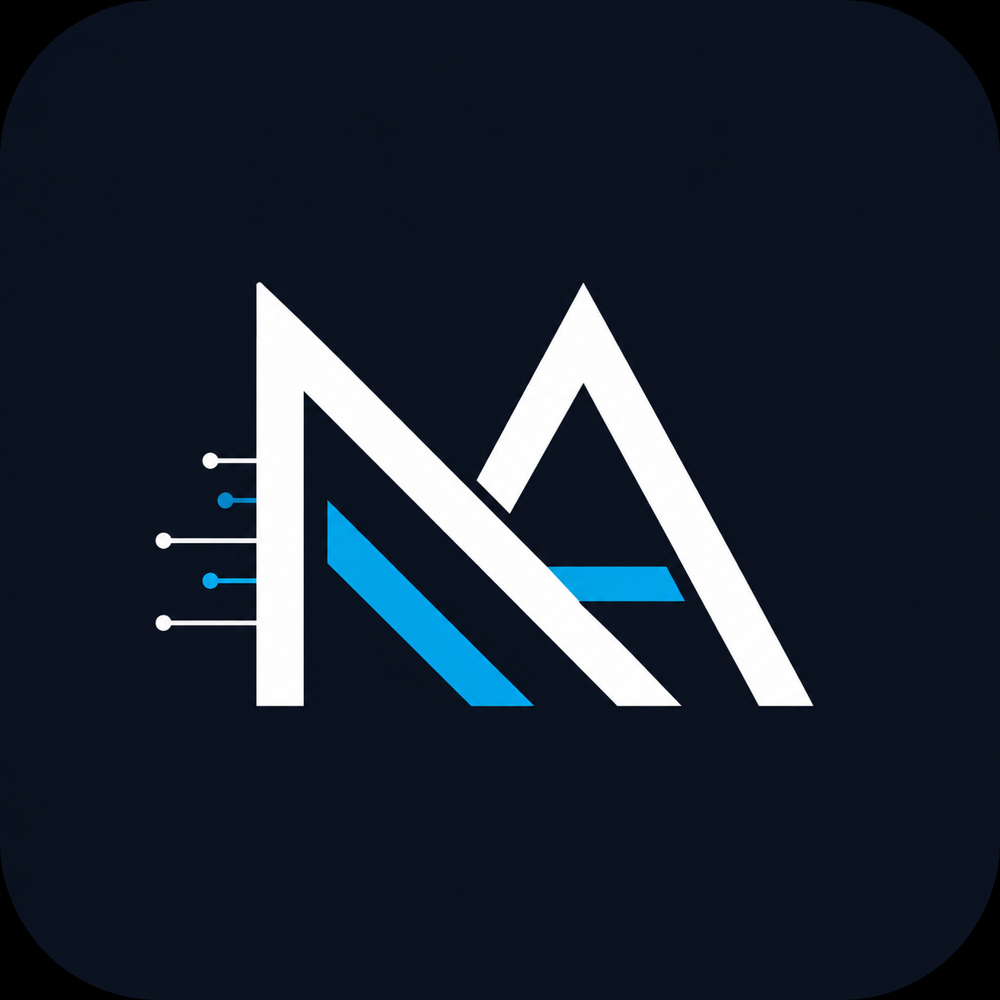

# Portfolio Identity Kit (FL-03)
 
**Track:** AI Fluency — Week 3  
**Artifact:** Master Identity Kit & Design Tokens  

---

## 1. Typography Selection

* **Heading & Display Font:** `Inter` (Weights: 600 Semi-Bold, 700 Bold) — Modern, clean, geometric sans-serif that renders crisply at all resolutions.
* **Body & UI Font:** `Inter` (Weights: 400 Regular, 500 Medium) — Unified pairing with zero font-switching overhead, optimized for dense technical scanning.
* **Monospace / Code Font (Auxiliary):** `JetBrains Mono` — For SQL queries, latency metrics, and terminal execution receipts.

---

## 2. Color Palette (Tight 4-Color System)

| Token Name | Hex Code | Visual Sample / Role | Usage Context |
| :--- | :--- | :--- | :--- |
| **Near-White Background** | `#F9FAFB` | `rgb(249, 250, 251)` | Clean, neutral canvas that eliminates eye strain. |
| **Near-Black Text** | `#111827` | `rgb(17, 24, 39)` | High-contrast primary headings and deep-dive technical body text. |
| **Structural Border / Neutral** | `#E5E7EB` | `rgb(229, 231, 235)` | 1px subtle cards, benchmark table grids, and code block borders. |
| **Accent / Action Color** | `#0284C7` | `rgb(2, 132, 199)` | Slate Cyan strictly reserved for primary Cal.com CTAs and key metric deltas (+20.3%). |

---

## 3. Logo & Monogram (Favicon Specification)

### Monogram Specification: `[ NA ]`
* **Concept:** Minimal, precision-bracketed engineering monogram.
* **Format:** PNG format (`favicon.png`), 64x64 / 512x512 resolution.
* **Visual Appearance:** Dark slate background (`#111827`) with Slate Cyan accent lettering (`#0284C7`).

### Favicon Preview


---

## 4. Two-Line Style Note (For Claude Project Custom Instructions)

```text
Style System: Inter (Headings/Body) + JetBrains Mono (Code); Palette: #F9FAFB (BG), #111827 (Text), #E5E7EB (Borders), #0284C7 (Accent CTA).
Design Mood: Minimal, high-contrast systems engineering aesthetic where clean typography and metric receipts frame the technical work without decorative distraction.